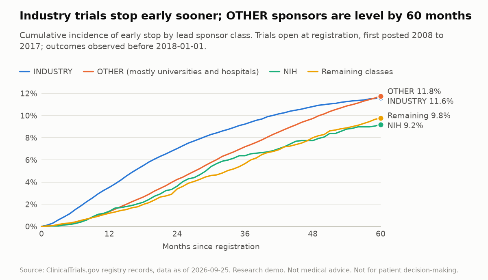
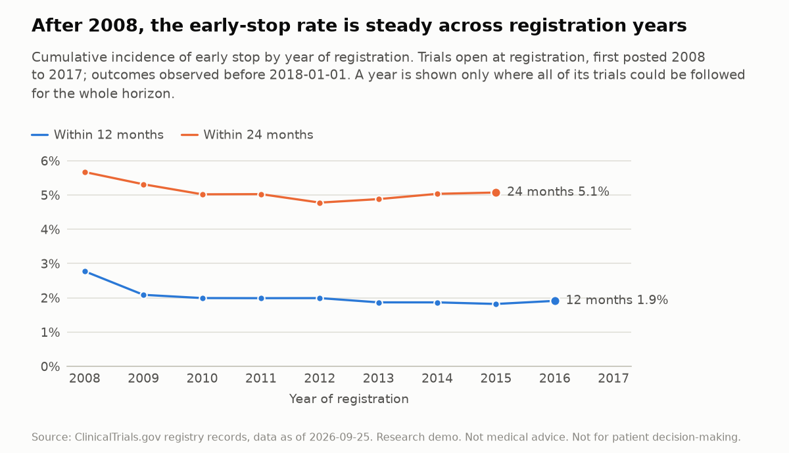
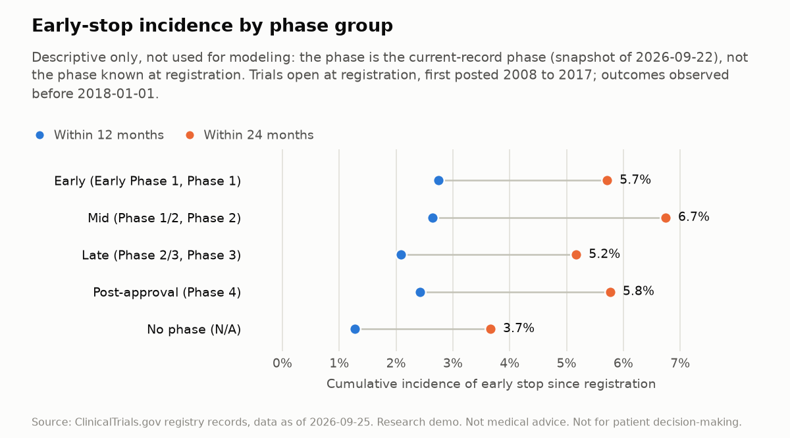
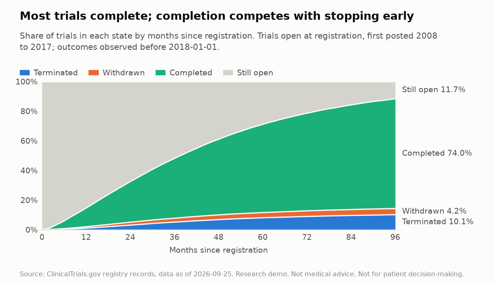
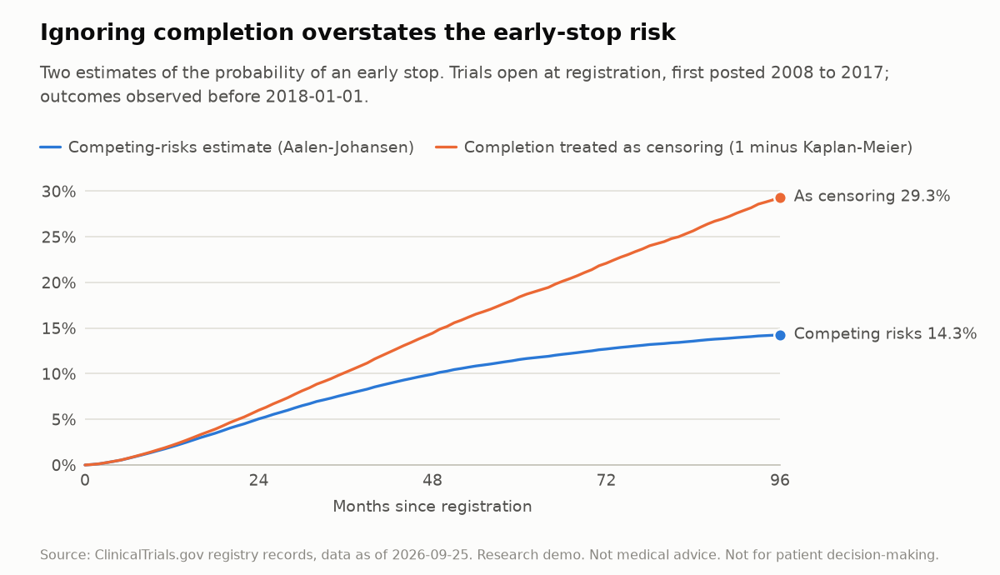
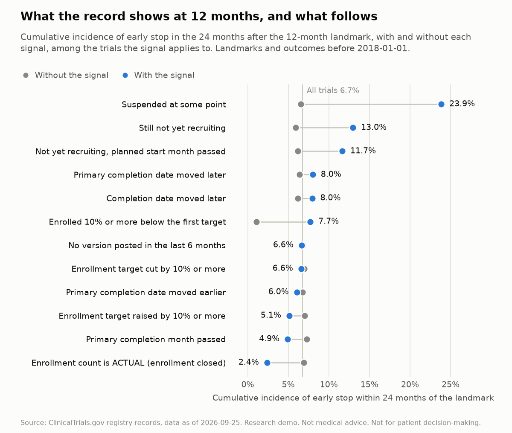
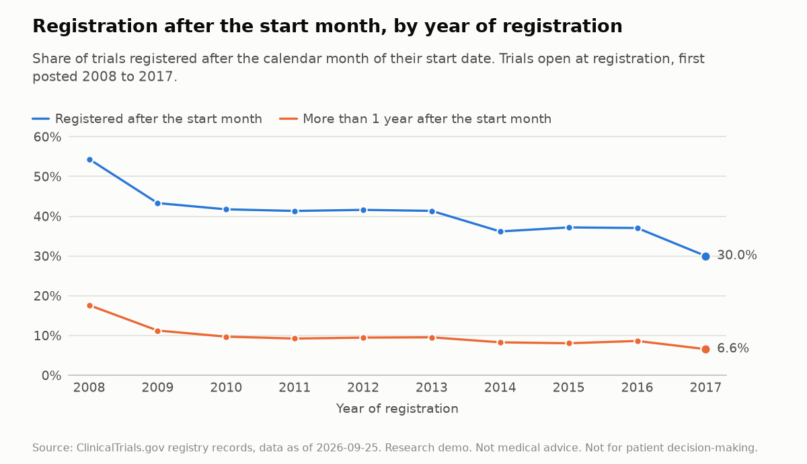
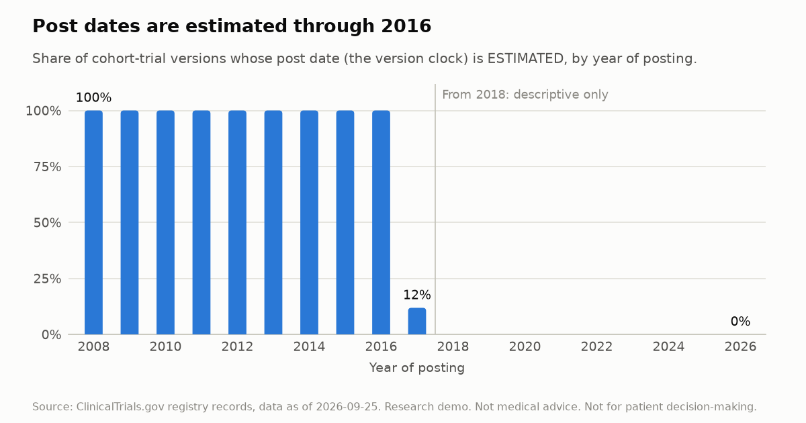
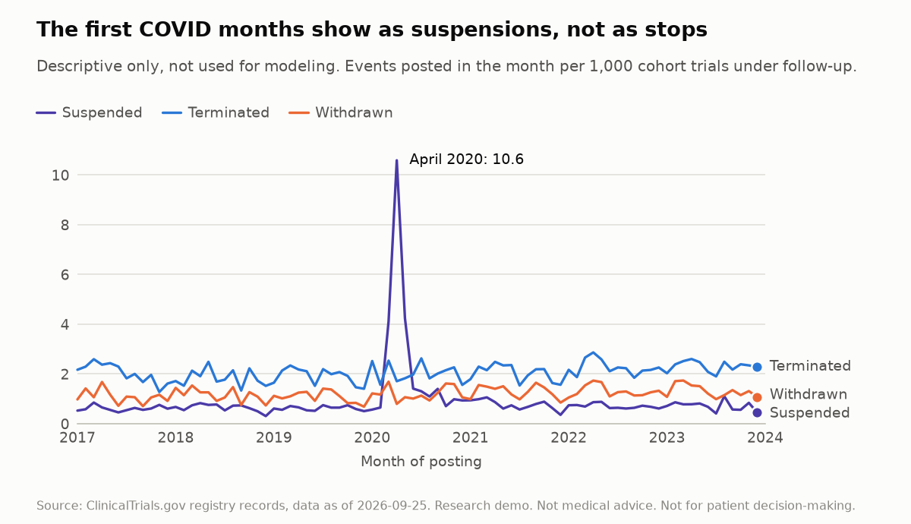

# Exploratory data analysis

Research demo. Not medical advice. Not for patient decision-making.

This file is generated by `uv run python -m trialpulse.eda.report` (CLAUDE.md Step 5). Do not edit it by hand: change `src/trialpulse/eda/` and regenerate.

- **Source:** ClinicalTrials.gov registry records, through the version-history dataset `brbk/clinical_trials_history` (license CC-BY-NC-4.0): dataset revision v2026.09.26, schema version 2, 4,444,542 versions with checksum 40994010935740108426806565.
- **Data as of 2026-09-25**, the latest post date in the pinned dataset revision. TrialPulse normalizes the records and derives the cohort, the outcomes and every statistic shown here.
- **Cohort:** 1,448,969 landmark rows of 330,121 trials (`data/cohort/landmarks.parquet`, built in Step 4).

## How to read this report

- **What is measured.** An "early stop" is a trial's first TERMINATED or WITHDRAWN version, and completion is the competing event (CLAUDE.md Section 6). Probabilities are cumulative incidence functions (CIF) from the Aalen-Johansen estimator: a trial whose follow-up ends without an outcome counts for as long as it was followed, and a completed trial can no longer stop early.
- **Modeling-relevant** sections read nothing dated 2018-01-01 or later (Section 10): they use landmarks before 2018-01-01 only, and an outcome on or after that date counts as not observed yet, exactly as for a model trained at the 2018 origin (Section 6). The locked test years stay unseen.
- **Descriptive only** sections and rows look at later dates, or at fields that are not point-in-time. They are labeled, and nothing in them is used to choose features or models.
- **Phase** has no version history (ADR 0006), so the phase section uses the current-record phase and is descriptive only, not used for modeling.
- **Censoring.** Follow-up ends without an outcome in two ways: at the end of the observation window (2018-01-01 in modeling-relevant sections), or earlier under the registry's UNKNOWN rule, when a record passed its completion date and went 2 years without a status verification (ADR 0014). The estimator treats both as unrelated to the outcome; Table 2 shows how common the second kind is.
- **Months and dates.** A horizon of m months is m times 365.25 / 12 days after the landmark (the evaluation harness of Step 8 counts calendar months, which differs only for an event that falls exactly on the horizon day). Dates are compared by calendar month, because the registry gives them to the month through 2016 and mostly to the day from 2017.
- **Every statement cites the figure or table that holds its numbers.** The findings in the last section are checked against the numbers each time the report is regenerated, and the command refuses to write a finding the data no longer supports.
- **No confidence intervals.** This report describes. Each table shows the size of its groups, and comparisons with bootstrap intervals come with the models in Steps 9 to 11.
- This describes registry records. "Elevated early-stop risk" is an operational statement about a trial record, never a statement about whether a treatment works.

## 1. Early-stop risk after registration

*Modeling-relevant: nothing dated 2018-01-01 or later is read.*
133,402 trials that were open at registration (landmark index 0), first posted from 2008-01-01 to 2017-12-31, with outcomes observed before 2018-01-01.

*Figure 1. Early-stop cumulative incidence by sponsor class.*

Table 1. Early-stop CIF by lead sponsor class at registration. OTHER is the registry's class for universities, hospitals and other organizations; the remaining classes (FED, OTHER_GOV, NETWORK, INDIV, UNKNOWN and records without a class) are pooled.

| Sponsor class | Trials | Early stops observed | CIF at 12 months | CIF at 24 months | CIF at 36 months | CIF at 60 months |
| --- | --- | --- | --- | --- | --- | --- |
| INDUSTRY | 39,695 | 3,813 | 3.5% | 7.0% | 9.2% | 11.6% |
| OTHER | 85,965 | 7,129 | 1.3% | 4.2% | 7.2% | 11.8% |
| NIH | 2,325 | 200 | 1.4% | 3.6% | 6.4% | 9.2% |
| Remaining classes | 5,417 | 398 | 1.2% | 3.4% | 5.7% | 9.8% |
| All | 133,402 | 11,540 | 2.0% | 5.1% | 7.7% | 11.6% |

- 2.0% of trials stopped early within 12 months of registration and 5.1% within 24 months (Table 1).
- INDUSTRY trials are at 3.5% after 12 months and 11.6% after 60; OTHER trials are at 1.3% and 11.8% (Figure 1, Table 1).

Table 2. Censoring under the UNKNOWN rule by sponsor class: trials whose follow-up ended that way, and its cumulative incidence with early stop and completion as competing events.

| Sponsor class | Trials | Censored under the UNKNOWN rule before 2018-01-01 | Incidence at 12 months | Incidence at 24 months | Incidence at 60 months |
| --- | --- | --- | --- | --- | --- |
| INDUSTRY | 39,695 | 794 | 1.0% | 1.7% | 2.3% |
| OTHER | 85,965 | 5,476 | 3.1% | 5.1% | 7.9% |
| NIH | 2,325 | 22 | 0.3% | 0.5% | 1.0% |
| Remaining classes | 5,417 | 499 | 4.7% | 7.2% | 10.5% |
| All | 133,402 | 6,791 | 2.5% | 4.1% | 6.2% |

- Within 60 months of registration 2.3% of INDUSTRY trials and 7.9% of OTHER trials are censored under the UNKNOWN rule (Table 2).

*Figure 2. Early-stop cumulative incidence by year of registration.*

Table 3. Early-stop CIF by year of registration. A cell is shown only where every trial of the year could be followed for the whole horizon before 2018-01-01.

| Registration year | Trials | Early stops observed | CIF at 12 months | CIF at 24 months |
| --- | --- | --- | --- | --- |
| 2008 | 11,053 | 1,641 | 2.8% | 5.7% |
| 2009 | 10,565 | 1,468 | 2.1% | 5.3% |
| 2010 | 10,722 | 1,437 | 2.0% | 5.0% |
| 2011 | 11,087 | 1,386 | 2.0% | 5.0% |
| 2012 | 12,279 | 1,416 | 2.0% | 4.8% |
| 2013 | 13,092 | 1,352 | 1.9% | 4.9% |
| 2014 | 14,456 | 1,215 | 1.9% | 5.0% |
| 2015 | 15,645 | 946 | 1.8% | 5.1% |
| 2016 | 16,965 | 549 | 1.9% | n/a |
| 2017 | 17,538 | 130 | n/a | n/a |
| All | 133,402 | 11,540 | 2.0% | 5.1% |

- From 2008 to 2015 the 24-month CIF lies between 4.8% and 5.7%; the highest 12-month CIF is 2.8%, for trials registered in 2008 (Figure 2, Table 3).

Table 4. Early-stop CIF over the months after each landmark, for trials still open at that landmark.

| Months since registration | Trials | Early stops observed | CIF within 12 months of the landmark | CIF within 24 months of the landmark |
| --- | --- | --- | --- | --- |
| 0 (landmark index 0) | 133,402 | 11,540 | 2.0% | 5.1% |
| 6 (landmark index 1) | 116,187 | 10,610 | 2.9% | 6.1% |
| 12 (landmark index 2) | 96,411 | 9,120 | 3.6% | 6.7% |
| 18 (landmark index 3) | 78,569 | 7,491 | 4.0% | 7.1% |
| 24 (landmark index 4) | 62,228 | 5,815 | 4.0% | 7.3% |
| 30 (landmark index 5) | 44,102 | 3,821 | 3.9% | 7.1% |
| 36 (landmark index 6) | 33,713 | 2,796 | 4.0% | 6.9% |

- A trial still open at a landmark has a 12-month CIF of 2.0% at registration and 4.0% 36 months later (Table 4).

## 2. Phase (descriptive only, not used for modeling)

*Descriptive only, not used for modeling.* Phase has no version history in the dataset (ADR 0006), so this section uses each trial's current-record phase from the API v2 snapshot of 2026-09-22. A phase edited after a trial's outcome was known would leak that outcome, so these numbers are not used to choose features or models. The trials and their outcomes are the same as in section 1.

*Figure 3. Early-stop cumulative incidence by phase group.*

Table 5. Descriptive only, not used for modeling: early-stop CIF by current-record phase group.

| Phase group (current record) | Trials | Early stops observed | CIF at 12 months | CIF at 24 months |
| --- | --- | --- | --- | --- |
| Early (Early Phase 1, Phase 1) | 19,105 | 1,689 | 2.7% | 5.7% |
| Mid (Phase 1/2, Phase 2) | 28,419 | 3,410 | 2.6% | 6.7% |
| Late (Phase 2/3, Phase 3) | 17,393 | 1,656 | 2.1% | 5.2% |
| Post-approval (Phase 4) | 13,088 | 1,298 | 2.4% | 5.8% |
| No phase (N/A) | 54,196 | 3,390 | 1.3% | 3.7% |
| No current record | 1,201 | 97 | 0.6% | 2.5% |
| All | 133,402 | 11,540 | 2.0% | 5.1% |

- Descriptive only: across phase groups the 24-month CIF runs from 3.7% for "No phase (N/A)" to 6.7% for "Mid (Phase 1/2, Phase 2)" (Figure 3, Table 5).
- Descriptive only: 1,201 trials have no record in the snapshot and form their own row (Table 5).

## 3. Stopping competes with completing

*Modeling-relevant: nothing dated 2018-01-01 or later is read.* The trials and their outcomes are the same as in section 1.

*Figure 4. Where trials are, by months since registration.*

*Figure 5. Two estimates of the early-stop probability.*

Table 6. Share of trials in each state by months since registration (Aalen-Johansen), and the early-stop estimate that treats a completion as censoring (1 minus Kaplan-Meier).

| Months since registration | Terminated | Withdrawn | Early stop (both) | Withdrawn share of early stops | Completed | Still open | Early stop, completion as censoring |
| --- | --- | --- | --- | --- | --- | --- | --- |
| 6 | 0.3% | 0.4% | 0.7% | 56.1% | 5.2% | 94.1% | 0.8% |
| 12 | 1.1% | 0.9% | 2.0% | 47.4% | 12.6% | 85.4% | 2.1% |
| 24 | 3.1% | 2.0% | 5.1% | 39.0% | 27.4% | 67.5% | 6.0% |
| 36 | 5.1% | 2.6% | 7.7% | 34.1% | 40.3% | 51.9% | 10.2% |
| 60 | 8.0% | 3.5% | 11.6% | 30.5% | 59.5% | 28.9% | 18.4% |
| 96 | 10.1% | 4.2% | 14.3% | 29.2% | 74.0% | 11.7% | 29.3% |

- 96 months after registration 74.0% of trials have completed, 14.3% have stopped early and 11.7% are still open (Figure 4, Table 6).
- By 12 months 0.9% of trials are withdrawn and 1.1% terminated; by 96 months, 4.2% and 10.1% (Table 6).
- Treating completion as censoring gives 6.0% at 24 months and 29.3% at 96 months, against 5.1% and 14.3% from the competing-risks estimator (Figure 5, Table 6).

## 4. Amendments by the 12-month landmark

*Modeling-relevant: nothing dated 2018-01-01 or later is read.*
96,411 trials still open 12 months after registration (landmark index 2). Each signal compares the record as it stood at the landmark, from versions posted on or before it, with the trial's first version. Nothing posted after the landmark is read. The enrollment count is a target while its type is ESTIMATED and the number enrolled once it is ACTUAL, so the three enrollment signals are compared among trials of one type.

Table 7. Share of trials showing each signal at the 12-month landmark, by what was observed afterwards (before 2018-01-01). Each share is taken among the trials where the signal is defined and its inputs are known.

| Signal at the landmark | Stopped early later (9,120) | Completed later (45,165) | No outcome observed (42,126) |
| --- | --- | --- | --- |
| Suspended at some point | 3.2% | 0.6% | 0.9% |
| Not yet recruiting, planned start month passed | 16.7% | 6.6% | 13.6% |
| Still not yet recruiting | 21.8% | 7.4% | 16.0% |
| Primary completion month passed | 15.9% | 29.8% | 13.7% |
| Primary completion date moved later | 23.1% | 24.1% | 20.3% |
| Completion date moved later | 22.9% | 24.0% | 19.1% |
| Primary completion date moved earlier | 2.0% | 3.5% | 2.4% |
| Enrollment count is ACTUAL (enrollment closed) | 1.3% | 6.0% | 2.9% |
| Enrollment target cut by 10% or more | 1.2% | 1.6% | 1.2% |
| Enrollment target raised by 10% or more | 1.8% | 3.0% | 2.7% |
| Enrolled 10% or more below the first target | 67.9% | 24.4% | 30.4% |
| No version posted in the last 6 months | 44.8% | 42.5% | 45.1% |
| Median versions posted so far | 2 | 2 | 2 |
| Median months moved, where the primary completion date moved later | 9 | 6 | 7 |

- 23.1% of the trials that later stopped early had moved their primary completion date later by the landmark, and 24.1% of the trials that later completed (Table 7).
- 21.8% of the trials that later stopped early were still not yet recruiting, against 7.4% of those that later completed; 3.2% against 0.6% had been suspended (Table 7).

*Figure 6. Early-stop cumulative incidence by what the record showed at the landmark.*

Table 8. Early-stop CIF in the 24 months after the 12-month landmark, with and without each signal, among the trials it is compared among. Over all 96,411 trials it is 6.7%.

| Signal at the landmark | Compared among | Trials with | Trials without | Outside the comparison or not known | CIF at 24 months with | CIF at 24 months without | Ratio |
| --- | --- | --- | --- | --- | --- | --- | --- |
| Suspended at some point | all trials | 950 | 95,461 | 0 | 23.9% | 6.5% | 3.64 |
| Still not yet recruiting | all trials | 12,108 | 84,303 | 0 | 13.0% | 5.9% | 2.20 |
| Not yet recruiting, planned start month passed | all trials | 10,199 | 85,924 | 288 | 11.7% | 6.2% | 1.89 |
| Primary completion date moved later | all trials | 20,954 | 72,844 | 2,613 | 8.0% | 6.4% | 1.26 |
| Completion date moved later | all trials | 17,086 | 61,610 | 17,715 | 8.0% | 6.2% | 1.28 |
| Enrolled 10% or more below the first target | trials with an ACTUAL enrollment count | 585 | 1,558 | 94,268 | 7.7% | 1.1% | 7.29 |
| No version posted in the last 6 months | all trials | 42,285 | 54,126 | 0 | 6.6% | 6.8% | 0.98 |
| Enrollment target cut by 10% or more | trials with an ESTIMATED enrollment count | 1,258 | 89,556 | 5,597 | 6.6% | 7.0% | 0.94 |
| Primary completion date moved earlier | all trials | 2,719 | 91,079 | 2,613 | 6.0% | 6.8% | 0.89 |
| Enrollment target raised by 10% or more | trials with an ESTIMATED enrollment count | 2,484 | 88,330 | 5,597 | 5.1% | 7.0% | 0.73 |
| Primary completion month passed | all trials | 20,299 | 74,606 | 1,506 | 4.9% | 7.3% | 0.68 |
| Enrollment count is ACTUAL (enrollment closed) | all trials | 3,999 | 91,782 | 630 | 2.4% | 6.9% | 0.34 |

- The 24-month CIF is 23.9% with a suspension on record and 6.5% for the other trials (Figure 6, Table 8).
- The 24-month CIF is 13.0% for trials still not yet recruiting and 5.9% for the other trials (Figure 6, Table 8).
- The 24-month CIF is 8.0% where the primary completion date moved later and 6.4% for the other trials (Figure 6, Table 8).
- The 24-month CIF is 6.6% where the enrollment target was cut by 10% or more and 7.0% for the other trials with an ESTIMATED enrollment count (Figure 6, Table 8).
- The 24-month CIF is 2.4% where the enrollment count is ACTUAL and 6.9% for the other trials (Figure 6, Table 8).
- The 24-month CIF is 7.7% where the number enrolled is 10% or more below the first target and 1.1% for the other trials with an ACTUAL enrollment count (Figure 6, Table 8).

## 5. Registration lag

*Years before 2018 are modeling-relevant; rows from 2018 on are descriptive only and marked.* Trials open at registration (landmark index 0). A trial is registered after its start month when the calendar month of its first version's start date ended before the first-post date. The comparison is by month for every trial, whatever the precision of its start date.

*Figure 7. Share of trials registered after their start month.*

Table 9. Registration timing by year of registration. The last year runs to 2026-09-25. The shares are taken among trials with a start date in their first version, and the days late are counted from the end of the start month.

| Registration year | Use | Trials | Start date given to the day | Registered after the start month | Median days late, among those | More than 1 year late | Median days from submission to first posting |
| --- | --- | --- | --- | --- | --- | --- | --- |
| 2008 | modeling | 11,053 | 0.0% | 54.4% | 145 | 17.6% | 3 |
| 2009 | modeling | 10,565 | 0.0% | 43.3% | 106 | 11.2% | 2 |
| 2010 | modeling | 10,722 | 0.0% | 41.7% | 100 | 9.7% | 3 |
| 2011 | modeling | 11,087 | 0.0% | 41.3% | 96 | 9.2% | 4 |
| 2012 | modeling | 12,279 | 0.0% | 41.6% | 98 | 9.5% | 6 |
| 2013 | modeling | 13,092 | 0.0% | 41.3% | 94 | 9.5% | 7 |
| 2014 | modeling | 14,456 | 0.0% | 36.2% | 96 | 8.3% | 5 |
| 2015 | modeling | 15,645 | 0.0% | 37.2% | 88 | 8.0% | 8 |
| 2016 | modeling | 16,965 | 0.0% | 37.0% | 102 | 8.6% | 8 |
| 2017 | modeling | 17,538 | 60.9% | 30.0% | 113 | 6.6% | 7 |
| 2018 | descriptive only | 18,536 | 72.1% | 29.9% | 84 | 5.8% | 12 |
| 2019 | descriptive only | 18,973 | 71.7% | 25.6% | 96 | 5.1% | 5 |
| 2020 | descriptive only | 19,910 | 70.6% | 22.1% | 96 | 4.9% | 7 |
| 2021 | descriptive only | 20,122 | 71.6% | 24.8% | 64 | 4.0% | 11 |
| 2022 | descriptive only | 20,922 | 72.9% | 25.3% | 78 | 4.1% | 11 |
| 2023 | descriptive only | 20,478 | 74.3% | 26.5% | 71 | 4.4% | 14 |
| 2024 | descriptive only | 23,327 | 76.0% | 24.6% | 88 | 4.5% | 8 |
| 2025 | descriptive only | 27,312 | 78.8% | 27.3% | 83 | 4.5% | 11 |
| 2026 | descriptive only | 25,439 | 78.7% | 29.6% | 82 | 4.7% | 9 |

- 54.4% of the trials registered in 2008 were registered after their start month, with a median delay of 145 days; in 2017 it was 30.0% and 113 days (Figure 7, Table 9).
- The first version gives the start date to the day for 0.0% of the trials registered in 2008 and for 60.9% of those registered in 2017 (Table 9).

Table 10. Early-stop CIF by registration timing, and its two parts at 24 months. Modeling-relevant: nothing dated 2018-01-01 or later is read.

| Registration timing | Trials | Early stops observed | CIF at 12 months | CIF at 24 months | CIF at 36 months | CIF at 60 months | Withdrawn within 24 months | Terminated within 24 months |
| --- | --- | --- | --- | --- | --- | --- | --- | --- |
| Registered in or before the start month | 79,625 | 7,360 | 2.3% | 5.9% | 8.9% | 13.1% | 2.8% | 3.1% |
| Registered up to 1 year after the start month | 39,496 | 3,173 | 1.7% | 4.1% | 6.5% | 10.0% | 0.9% | 3.3% |
| Registered more than 1 year after the start month | 12,486 | 781 | 1.3% | 3.0% | 4.7% | 7.3% | 0.4% | 2.6% |
| No start date | 1,795 | 226 | 2.0% | 5.4% | 8.3% | 12.5% | 2.6% | 2.8% |
| All | 133,402 | 11,540 | 2.0% | 5.1% | 7.7% | 11.6% | 2.0% | 3.1% |

- The 24-month CIF is 5.9% for trials registered in or before their start month, 4.1% for trials registered up to 1 year after it and 3.0% for trials registered more than 1 year after it (Table 10).
- Within 24 months 2.8% of the trials registered in or before their start month are withdrawn and 3.1% terminated; for trials registered more than 1 year after it, 0.4% and 2.6% (Table 10).

## 6. Estimated post dates

*A property of the registry's records, not of outcomes. Rows from 2018 on are still marked descriptive only, and the second table reads only versions posted before 2018-01-01.* The version clock is each version's post date (Section 6). A post date marked ESTIMATED was derived by the registry and not recorded.

*Figure 8. Share of versions with an estimated post date.*

Table 11. Versions of cohort trials by year of posting: the share with an ESTIMATED post date, and the days from submission to posting.

| Year of posting | Use | Versions | ESTIMATED post date | Median days from submission to posting | 90th percentile |
| --- | --- | --- | --- | --- | --- |
| 2008 | modeling | 31,763 | 100.0% | 1 | 4 |
| 2009 | modeling | 60,588 | 100.0% | 1 | 4 |
| 2010 | modeling | 76,445 | 100.0% | 1 | 4 |
| 2011 | modeling | 89,488 | 100.0% | 1 | 4 |
| 2012 | modeling | 94,501 | 100.0% | 2 | 4 |
| 2013 | modeling | 99,159 | 100.0% | 2 | 4 |
| 2014 | modeling | 119,142 | 100.0% | 1 | 4 |
| 2015 | modeling | 133,879 | 100.0% | 1 | 4 |
| 2016 | modeling | 141,586 | 100.0% | 1 | 4 |
| 2017 | modeling | 160,049 | 11.9% | 2 | 5 |
| 2018 | descriptive only | 169,346 | 0.0% | 2 | 5 |
| 2019 | descriptive only | 181,120 | 0.0% | 2 | 4 |
| 2020 | descriptive only | 184,809 | 0.0% | 2 | 5 |
| 2021 | descriptive only | 192,869 | 0.0% | 2 | 7 |
| 2022 | descriptive only | 222,520 | 0.0% | 2 | 8 |
| 2023 | descriptive only | 202,072 | 0.0% | 2 | 7 |
| 2024 | descriptive only | 206,158 | 0.0% | 2 | 7 |
| 2025 | descriptive only | 204,310 | 0.0% | 3 | 8 |
| 2026 | descriptive only | 173,587 | 0.0% | 3 | 6 |

- The ESTIMATED share is 100.0% in every year from 2008 to 2016, and 11.9% in 2017 (Figure 8, Table 11).

Table 12. Days from submission to posting for versions of cohort trials posted before 2018-01-01, by the type of the post date. First versions set time zero and every landmark, so they are shown apart.

| Post date | Version | Versions | Median days | 90th percentile |
| --- | --- | --- | --- | --- |
| ACTUAL | First version | 15,708 | 3 | 6 |
| ACTUAL | Later version | 125,365 | 2 | 5 |
| ESTIMATED | First version | 118,463 | 2 | 5 |
| ESTIMATED | Later version | 747,064 | 1 | 4 |

- For the 15,708 first versions with an actual post date, posting follows submission by a median of 3 days, and by 6 days at the 90th percentile (Table 12).
- For the 125,365 later versions with an actual post date, posting follows submission by a median of 2 days, and by 5 days at the 90th percentile (Table 12).

## 7. The COVID period (descriptive only)

*Descriptive only, not used for modeling.* Calendar months from 2017-01 to 2023-12, which include the locked test and stress-test years. A rate is the number of events posted in a month per 1,000 cohort trials under follow-up at the start of that month. A suspension is a SUSPENDED version that follows a version with another status.

*Figure 9. Monthly suspensions and stops, 2017 to 2023.*

Table 13. Descriptive only: average monthly rates per 1,000 trials under follow-up.

| Period | Months | Trials under follow-up (average) | Suspended per 1,000 | Terminated per 1,000 | Withdrawn per 1,000 |
| --- | --- | --- | --- | --- | --- |
| 2017 to 2019 | 36 | 56,235 | 0.63 | 1.94 | 1.11 |
| March to May 2020 | 3 | 61,546 | 6.32 | 2.03 | 1.19 |
| June 2020 to December 2021 | 19 | 64,955 | 0.89 | 2.05 | 1.27 |
| 2022 to 2023 | 24 | 68,030 | 0.71 | 2.29 | 1.32 |

- Descriptive only: new suspensions averaged 0.63 per 1,000 trials per month in 2017 to 2019 and 6.32 in March to May 2020 (Table 13); the highest month is April 2020 with 10.6 (Figure 9).
- Descriptive only: terminations averaged 1.94 per 1,000 in 2017 to 2019 and 2.03 in March to May 2020; withdrawals 1.11 and 1.19 (Table 13).

## 8. Findings and what they imply for modeling

1. **Early stops are uncommon, and sponsor classes differ in when they happen.** 2.0% of trials stop early within 12 months of registration and 5.1% within 24. INDUSTRY trials reach 3.5% at 12 months against 1.3% for OTHER, and the two classes are at 11.6% and 11.8% by 60 months (Figure 1, Table 1). OTHER trials are also censored under the UNKNOWN rule more often: 7.9% within 60 months against 2.3% for INDUSTRY (Table 2).
   *Implication for modeling:* Sponsor class is a sound stratifier for M0. It enters the discrete-time models with the sponsor family (Section 8), where it should be free to interact with the interval index, because its effect fades with time since registration; the Cox analysis should expect the proportional-hazards check to fail for it. The comparison at long horizons assumes that censoring under the UNKNOWN rule is unrelated to the outcome, and that censoring is 3.4 times as common for OTHER sponsors. The Section 6 sensitivity analysis (UNKNOWN as an early stop) therefore matters most for that class, and whether one censoring curve for all trials is enough for the IPCW metrics is a question to settle before Step 9.
2. **Completion is the common ending, and ignoring it overstates the risk.** By 96 months 74.0% of trials have completed and 14.3% have stopped early. Treating completion as censoring gives 29.3% instead of 14.3% at 96 months, and 6.0% instead of 5.1% at 24 months (Figures 4 and 5, Table 6).
   *Implication for modeling:* Targets, baselines and metrics must be competing-risks quantities (Aalen-Johansen CIFs, multinomial interval hazards, IPCW with completions as controls), as Sections 6 and 9 specify. A binary classifier that drops or censors completed trials would be miscalibrated upward, and more so at longer horizons.
3. **Risk over the next year rises after registration and then levels off.** The 12-month CIF is 2.0% at registration and between 3.9% and 4.0% from the 18-month landmark on (Table 4). Withdrawn trials are 47.4% of the early stops by 12 months and 29.2% by 96 months (Figure 4, Table 6).
   *Implication for modeling:* The landmark index and the months since registration belong in the feature set (Section 8, time family). Metrics must be read per landmark index and not only pooled, because a model can score well pooled just by telling early landmarks from late ones.
4. **At 12 months, a trial's status and enrollment state separate risk more than date or target edits.** The 24-month CIF is 23.9% with a suspension on record against 6.5% without, and 13.0% for trials still not yet recruiting against 5.9%. Edits separate less: a primary completion date moved later gives 8.0% against 6.4%, an enrollment target cut 6.6% against 7.0% and a target raised 5.1% against 7.0% (Figure 6, Table 8). A later primary completion date is about as common among trials that later stopped (23.1%) as among trials that later completed (24.1%) (Table 7). Where enrollment has closed (the count is ACTUAL) the CIF is 2.4% against 6.9%, but 7.7% for the 585 trials that enrolled 10% or more below their first target against 1.1% for the rest (Table 8).
   *Implication for modeling:* The amendment family should carry status history (ever suspended, still not recruiting, start overdue) beside the date and enrollment changes. A yes or no slip flag is weak alone, so the features should keep the size and direction of each change and leave interactions to M4. An enrollment count is a target while its type is ESTIMATED and the number enrolled once it is ACTUAL, so the enrollment change ratio of Section 8 must be read together with the enrollment type: LightGBM can learn that, and the logistic model M3 needs the interaction written out. All of these read only versions posted on or before the landmark, which the future-perturbation test of Step 7 must confirm.
5. **Trials registered in or before their start month carry more early-stop risk.** The 24-month CIF is 5.9% for trials registered in or before their start month, 4.1% for trials registered up to 1 year after it and 3.0% for trials registered later than that. The gap is in withdrawals (2.8%, 0.9% and 0.4% within 24 months), while terminations are about as common (3.1%, 3.3% and 2.6%) (Table 10). The share registered after the start month falls from 54.4% in 2008 to 30.0% in 2017, and start dates are given to the day for 60.9% of the trials registered in 2017 against 0.0% in 2016 (Figure 7, Table 9).
   *Implication for modeling:* Time zero is registration, so a trial registered late has usually passed the point where trials are withdrawn before enrolling. Retrospective registration and the lag are needed design features (Section 8): without them a model would read survivorship as low risk. The registry's start dates change from month to day precision just before the locked test years, so these features should be computed on one basis (the calendar month) or carry the precision with them; otherwise a change of precision would look like a change of behavior. Both the share and the precision are drift signals to monitor.
6. **After 2008, the base rate is stable across registration years.** The 24-month CIF stays between 4.8% and 5.3% for trials registered from 2009 to 2015, and the 12-month CIF between 1.8% and 2.1% from 2009 to 2016. 2008 is higher at both horizons, 2.8% and 5.7% (Figure 2, Table 3), although it has the largest share of late registrations (Table 9).
   *Implication for modeling:* Training on earlier years to predict later ones, the walk-forward design, is reasonable for the overall level of risk. The first year after the 2007 registration mandate is different, and this report does not explain why: registration timing does not account for it, since a year with more late registrations would be expected to show a lower rate (finding 5). Registration year, or an indicator for that first year, stays a candidate feature for the Step 10 ablation, and calibration should be checked by registration year in Step 9.
7. **Post dates are estimated through 2016, and the likely error is days, not months.** Every version posted through 2016 has an ESTIMATED post date, and 11.9% of those posted in 2017 (Figure 8, Table 11). Among versions posted before 2018 with an actual post date, posting follows submission by a median of 2 days (90th percentile 5) for 125,365 later versions and 3 days (90th percentile 6) for 15,708 first versions (Table 12).
   *Implication for modeling:* Point-in-time reconstruction through 2016 rests on estimated post dates. Where the registry recorded the post date it trails submission by days, so a few days is the likely error of an estimated one: small against landmarks 6 months apart, and no correction is needed. The date type changes just before the locked test years, so it would stand in for calendar time and must never be a feature. Features counted in days (days since the last update) may be distributed slightly differently before and after the change: a drift check for Step 17.
8. **Descriptive only: the first COVID months show as suspensions, not as stops.** New suspensions averaged 0.63 per 1,000 trials per month in 2017 to 2019 and reached 10.6 in April 2020 (Figure 9). Terminations averaged 1.94 per 1,000 in 2017 to 2019 and 2.03 in March to May 2020; withdrawals 1.11 and 1.19 (Table 13).
   *Implication for modeling:* Nothing here shapes a model (Section 10). Before 2018 a suspension on record marks elevated early-stop risk (finding 4). Whether that still held for the suspensions of 2020 cannot be read from monthly rates, and it was not examined, because it would read outcomes of the locked stress-test period. It is a natural hypothesis for the Step 11 pre-registration, which should then say that these descriptive aggregates prompted it. Monitoring should track the suspension rate as a drift signal.

## Not in this report

- **Why trials stop.** The reasons section (distribution by year, phase and sponsor class) waits for the final Step 6 labels and will be added as an addendum.
- **Therapeutic areas.** No point-in-time therapeutic area exists in the version history (ADR 0007), so there is no breakdown by area.
- **Models.** Nothing here fits or evaluates a model, and no locked origin was evaluated.
